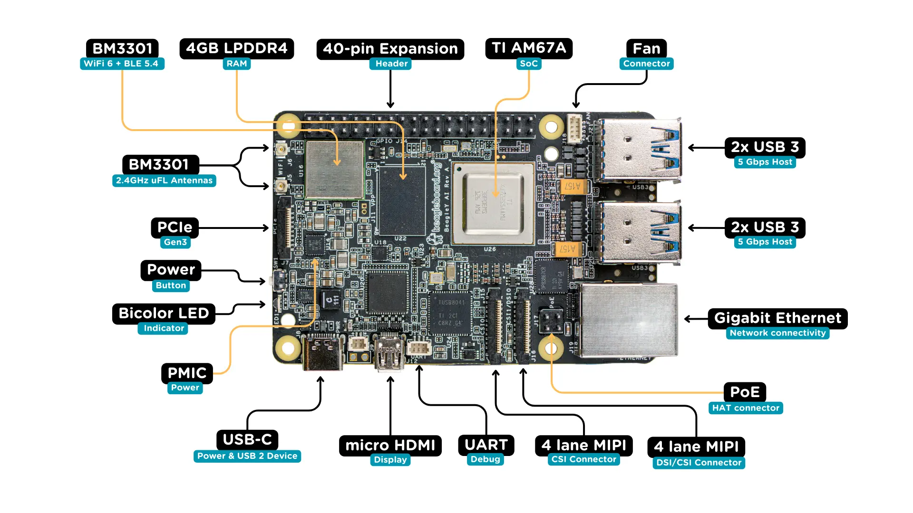

.. _beagley_ai:

BeagleY-AI
##########

.. _todo:: This whole document needs a detailed review

Overview
********
BeagleY-AI is a computational platform powered by TI AM67A (J722S) SoC, which is
targeted for automotive applications.

Hardware
********
BeagleY-AI is powered by TI AM67A (J722S) SoC, which has two domains (Main,
MCU). This document gives overview of Zephyr running on Cortex R5 in the
Main domain.

L1 Memory System
----------------
BeagleY-AI defaults to single-core mode for the R5 subsystem. Changes in that
will impact the L1 memory system configuration.

* 32KB instruction cache
* 32KB data cache
* 128KB tightly-coupled memory (TCM)
  * 64KB TCMA
  * 64KB TCMB

Region Address Translation
--------------------------
The RAT module performs a region based address translation. It translates a
32-bit input address into a 36-bit output address. Any input transaction that
starts inside of a programmed region will have its address translated, if the
region is enabled.

VIM Interrupt Controller
------------------------
The VIM aggregates device interrupts and sends them to the R5F CPU(s). The VIM
module supports 512 interrupt inputs per R5F core. Each interrupt can be either
a level or a pulse (both active-high). The VIM has two interrupt outputs per core
IRQ and FIQ.

Supported Features
******************
The board configuration supports a console UART via the HAT header pins. Future
versions will also support a console over RPmsg.

+-----------+------------+-----------------------+
| Interface | Controller | Driver/Component      |
+===========+============+=======================+
| UART      | on-chip    | serial port-polling   |
|           |            | serial port-interrupt |
+-----------+------------+-----------------------+

Other hardwares features are currently not supported.

The default configuration can be found in the defconfig file.

Future configurations will add support for GPIO, I2C, SPI, etc.

Running Zephyr
**************

The AM67A does not have a separate flash for the R5 core. Because of this
an A53 core has to load the program for the R5 core to the right memory
address, set the PC and start the processor.
This can be done from Linux on the A53 core via remoteproc.

This is the memory mapping from A53 to the memory usable by the R5. Note that
the R5 core always sees its local TCMA at address 0x00000000 and its TCMB0
at address 0x41010000. (TBD)

The A53 Linux configuration allocates a region in DDR that is shared with
the R5. The amount of the allocation can be changed in the Linux device tree.
Note that BeagleY-AI has 4GB of DDR.

+-------------------+---------------+--------------+--------+
| Region            | A53 Main Addr | R5FSS Core0  | Size   |
+===================+===============+==============+========+
| R5-TCMA           | 0x0078400000  | 0x0000000000 | 64KB   |
+-------------------+---------------+--------------+--------+
| R5-TCMB           | 0x0078500000  | 0x0041010000 | 64KB   |
+-------------------+---------------+--------------+--------+
| DDR Shared Region | 0x00a2000000  | 0x00A2000000 | 1MB    |
+-------------------+---------------+--------------+--------+

.. todo:: validate the memory map on both R5 and A53

Steps to run the image
----------------------
The example shows how to load an image on Cortex R5FSS_CORE0 on AM67A.

| Copy Zephyr image to the /lib/firmware/ directory.
| ``cp build/zephyr/zephyr.elf /lib/firmware/``
|
| Ensure the Core is not running.
| ``echo stop > /dev/remoteproc/TBD/state``
|
| Configuring the image name to the remoteproc module.
| ``echo zephyr.elf > /dev/remoteproc/TBD/firmware``
|
| Once the image name is configured, send the start command.
| ``echo start > /dev/remoteproc/TBD/state``

Console
-------
The Zephyr on BeagleY-AI Cortex R5 uses UART 1 (HAT pins 8-TX, 10-RX)
as console.

References
**********
* `BeagleY-AI Homepage <https://beagley.ai>`_
* `AM67A TRM <https://www.ti.com/lit/zip/sprujb3>`_
* `Pinout guide <https://pinout.beagley.ai/>`_
* `Documentation <https://docs.beagleboard.org/latest/boards/beagley/ai>`_
